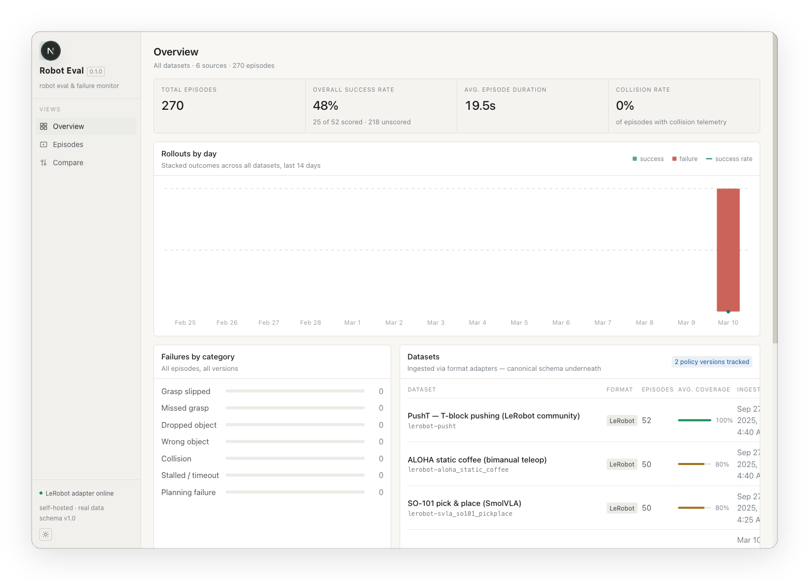
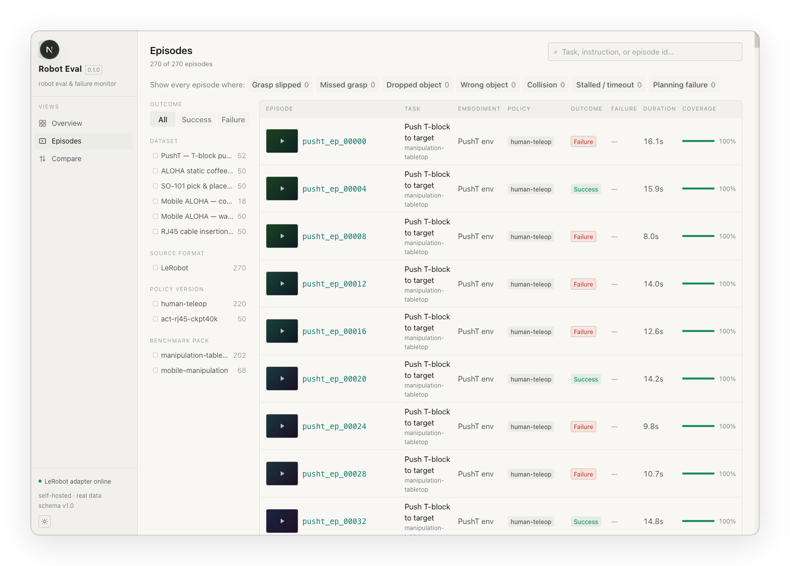
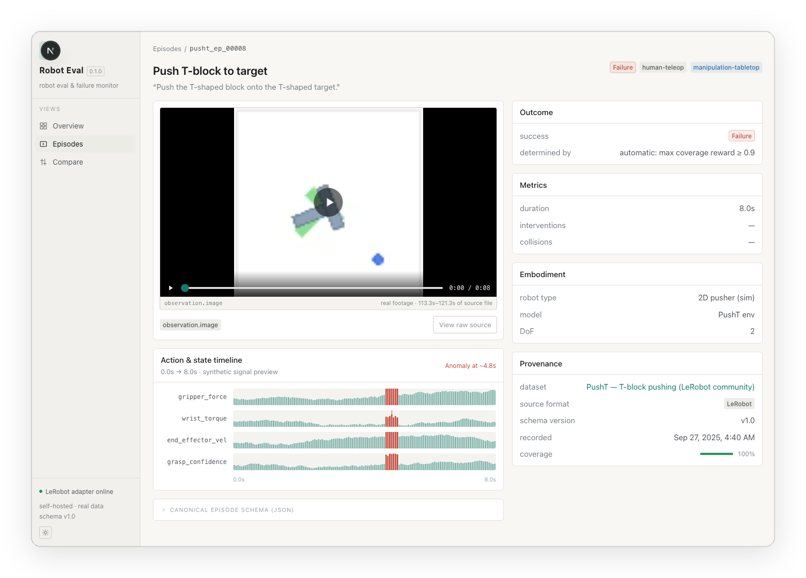
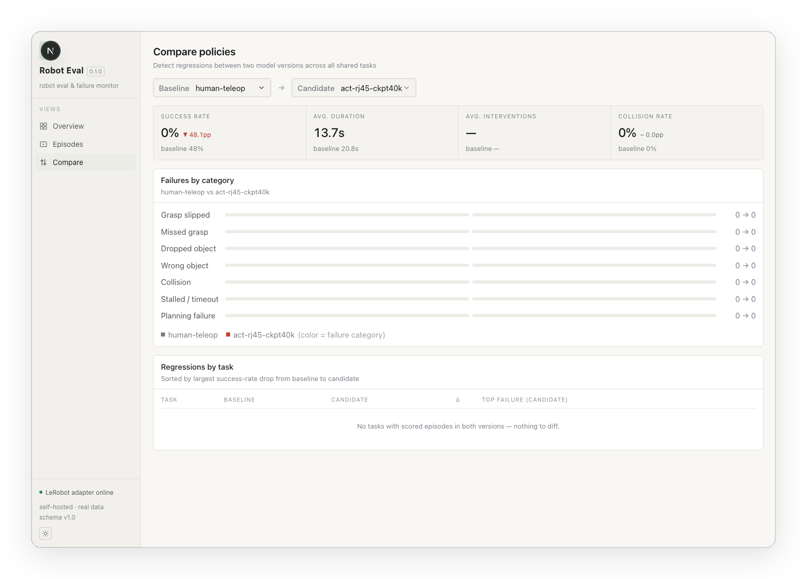

<p align="center">
  
</p>

<h1 align="center">Robot Eval</h1>
<p align="center"><strong>A local-first dashboard for browsing, filtering, and diffing real robot-policy eval rollouts.</strong></p>

<p align="center">
  
  
  
  
  
  
</p>

---

Every robot-eval team ends up with the same problem: rollouts land in whatever
format the recording stack happened to produce (LeRobot parquet, a ROS 2 bag,
a folder of CSVs and MP4s), and nobody can answer "did the new policy
actually regress?" without writing a one-off notebook.

**Robot Eval** normalizes all of that into one canonical episode schema, then
gives you three views on top of it: an overview of everything that's
happening across datasets, a filterable episode explorer with the real
observation video and per-timestep telemetry, and a policy-vs-policy compare
view that surfaces regressions by task and failure category automatically.

It ships pre-loaded with **280 real episodes across 7 public datasets, in two
different source formats**: no mock data, no seed script required. Clone it
and it works.

## Features

- **Overview**: total episodes, success rate, avg. duration, collision rate,
  a 14-day rollout trend chart, and a failure-category breakdown, all
  computed live from whatever's in `src/data/`.
- **Episode explorer**: search by task/instruction/id, filter by outcome,
  dataset, source format, policy version, benchmark pack, or failure
  category, all URL-encoded so a filtered view is a shareable link.
- **Episode detail**: plays the actual observation video for that rollout
  (real footage, not a placeholder), renders an action/state timeline with
  automatic anomaly highlighting, and shows outcome, metrics, embodiment,
  and full provenance. When the adapter kept one, "View raw source" links
  straight to that episode's real underlying data file.
- **Compare**: pick a baseline and candidate policy version and get an
  instant regression report: success-rate delta, failure-category diff, and
  a per-task table sorted by the largest drop. "Which task got worse and why"
  is a page load, not an investigation.
- **Permissive ingestion**: the canonical `Episode` schema treats almost
  every field as optional and tracks a `coverage` score per episode, because
  real datasets never populate every field. Nothing breaks when data is
  missing; the gaps are just visible, and vary honestly by source (see below).

## Screenshots

| | |
|---|---|
|  |  |
| Overview: cross-dataset stats and trends | Episode explorer: filterable, with real video thumbnails |
|  |  |
| Episode detail: real footage plus anomaly-highlighted telemetry | Compare: regression detection across policy versions |

## Quickstart

```bash
git clone git@github.com:zeroSec1/robot-eval-platform.git
cd robot-eval-platform
npm install
npm run dev
```

Open [http://localhost:3000](http://localhost:3000). All 280 bundled
episodes' metadata is already in `src/data/`, so the app is fully usable
immediately. Video playback falls back to each dataset's original remote URL
until you run the download script below.

To play video fully offline (and get the poster frames the demo screenshots
show):

```bash
node scripts/download-videos.mjs
```

This mirrors every LeRobot-sourced clip into `public/videos/` and rewrites
each episode's `video.url` to the local copy. Safe to re-run, already
downloaded files are skipped. The RoboTurk episodes (see below) already ship
with local video from their own adapter.

## The bundled datasets

| Dataset | Format | Episodes | Task |
|---|---|---:|---|
| PushT, T-block pushing | LeRobot | 52 | Push a T-block onto a target |
| ALOHA static coffee | LeRobot | 50 | Bimanual teleop coffee task |
| SO-101 pick & place (SmolVLA) | LeRobot | 50 | Tabletop pick & place |
| Mobile ALOHA, cook shrimp | LeRobot | 18 | Mobile manipulation |
| Mobile ALOHA, wash pan | LeRobot | 50 | Mobile manipulation |
| RJ45 cable insertion (ACT policy eval) | LeRobot | 50 | Precision insertion, ACT checkpoint |
| Sawyer laundry layout (RoboTurk, real teleop) | CSV + video | 10 | Flatten and lay out a cloth item |

Two independent adapters feed the same schema:

- **LeRobot sources** (`scripts/fetch-lerobot.mjs`) pull straight from public
  [LeRobot](https://huggingface.co/lerobot) datasets on Hugging Face, reading
  parquet episode metadata with [`hyparquet`](https://github.com/hyparam/hyparquet).
  Re-run it to refresh or add datasets; it writes straight into `src/data/`.
- **The RoboTurk source** (`scripts/fetch-roboturk.py`) downloads Stanford's
  real, MIT-licensed [RoboTurk teleoperation dataset](https://github.com/RoboTurk-Platform/roboturk_real_dataset),
  converts its HDF5 telemetry into a genuine per-episode CSV file next to the
  real demonstration video, and merges the result in as `sourceFormat:
  "csv_video"`. Run `fetch-lerobot.mjs` first; `fetch-roboturk.py` merges
  into whatever's already in `src/data/` rather than overwriting it.

The two formats also make the `coverage` field mean something concrete: the
LeRobot sources mostly carry recorded success/failure outcomes, while
RoboTurk's raw human demonstrations have none (`outcome.success` stays
`null`, honestly), which alone drops that dataset's coverage score relative
to the others.

## Data model

Every source format gets adapted into one canonical shape, so the UI never
has to know whether an episode came from a LeRobot parquet file, a ROS 2 bag,
or a raw CSV log:

```ts
interface Episode {
  episodeId: string;
  datasetId: string;
  sourceFormat: "lerobot" | "ros2_bag" | "csv_video";
  policyVersion: string;
  task: Task;
  embodiment: Embodiment;
  outcome: Outcome;                 // success, and how it was determined
  failure: Failure | null;          // category + subcategory, if any
  metrics: Metrics;                 // duration, interventions, collisions
  video?: VideoRef;                 // real observation footage, when available
  rawSourceUrl?: string;            // link to the episode's real underlying data file
  coverage: number;                 // 0-1: how much of the schema is actually populated
}
```

Optional fields aren't a modeling compromise, they're the point. Real eval
data is never fully populated, so `coverage` makes the gaps a first-class,
sortable/filterable signal instead of something the UI has to paper over.
`ros2_bag` is defined in the schema and the UI already filters/labels for it,
but there's no ingested dataset for it yet, unlike `lerobot` and `csv_video`.

## Tech stack

- [Next.js 16](https://nextjs.org) (App Router, Turbopack) + React 19 + TypeScript
- Tailwind CSS v4
- No backend, no database: episode/dataset JSON in `src/data/` is the entire
  persistence layer, read at build/request time
- Data pipeline: `scripts/fetch-lerobot.mjs` (Hugging Face parquet, normalized
  to canonical JSON) and `scripts/fetch-roboturk.py` (HDF5 converted to real
  CSV, normalized the same way), plus `scripts/download-videos.mjs` to mirror
  video for offline playback

## Scripts

| Command | What it does |
|---|---|
| `npm run dev` | Start the dev server (Turbopack) |
| `npm run build` / `npm run start` | Production build / serve |
| `npm run lint` | ESLint |
| `node scripts/fetch-lerobot.mjs` | Refresh `src/data/` from public LeRobot datasets |
| `python3 scripts/fetch-roboturk.py` | Ingest the RoboTurk CSV + video dataset (needs `pip install h5py numpy`; run after `fetch-lerobot.mjs`) |
| `node scripts/download-videos.mjs` | Mirror LeRobot episode videos into `public/videos/` for offline playback |
| `python3 scripts/capture-guide-shots.py` | Regenerate documentation screenshots (Playwright, needs the app running on `:3000`) |
| `python3 scripts/build-guide-pdf.py` | Rebuild `Robot Eval User Guide.pdf` |

## License

MIT, see [LICENSE](LICENSE).
